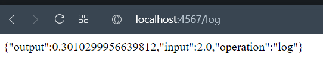
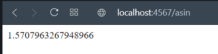
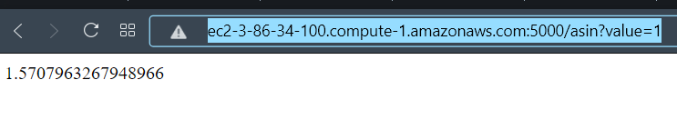
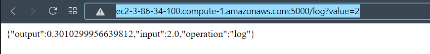

# Parcial 2
### Juan Sebastian Garcia Hincapie 
## cc 100950506 (log y asin)  
## AWS
funcionamiento en local




###Funcionamiento en aws : 
 



Para clonar el repositorio debemos de correr el siguiente comando en cmd o en la terminal 

```sh
git clone https://github.com/jsebasg/parciall2corte.git
 ```

 Y luego entraremos a la carperta parcial2corte

```sh
$ cd parcial2corte
 ```
Compilaremos los proyectos con el siguiente comando, debemos de entrar a la carpeta de cada uno

 ```sh
$ mvn package
 ```
Luego ejecutamos el siguiente comando para ejecutar el docker

```sh
$ docker build --tag parcial2corte .
$ docker run -d -p 5000:6000 --name parcial2corte parcial2corte
 ```

link aws 
http://ec2-3-86-34-100.compute-1.amazonaws.com:5000 (añada la extencion /*log o /*asin ?value= *numero* al final para la correcta ejecucion)


## Construido con

* [Java] (https://www.oracle.com/technetwork/java/javase/downloads/jdk8-downloads-2133151.html)
* [Maven] (https://maven.apache.org/)
* [Docker] (https://www.docker.com)
* [AWS] (https://aws.amazon.com/es/)

## Licencia

Este proyecto está licenciado bajo la Licencia MIT - vea el archivo [LICENSE.md] (LICENSE.md) para más detalles
